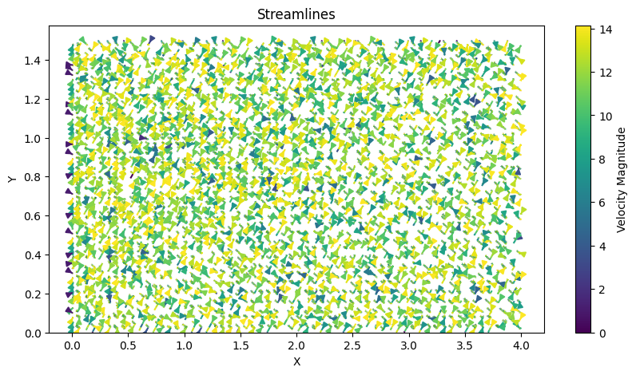
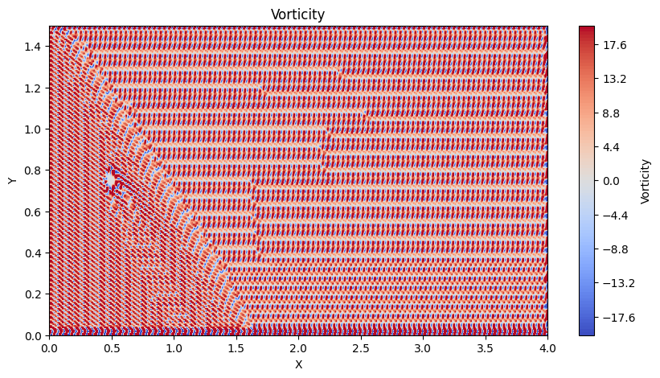

# 2D Incompressible Flow Around a Cylinder

This project simulates 2D incompressible flow around a cylinder using the Navier-Stokes equations. The simulation explores the behavior of fluid flow, with a focus on streamlines and vorticity visualizations to highlight vortex shedding and rotational flow patterns.

---

## Features
- **Numerical Solver**: Finite-difference method for solving the Navier-Stokes equations for incompressible flow.
- **Visualization**:
  - **Streamlines**: Illustrate the velocity field around the cylinder.
  - **Vorticity**: Highlight regions of rotational flow and vortex shedding patterns.
- **Adjustable Parameters**: Reynolds number, grid resolution, domain size, and cylinder geometry.

---

## Simulation Details
- **Reynolds Number**: \( Re = 10 \)
- **Grid Resolution**: \( 600 \times 200 \)
- **Domain Size**: \( 4.0 \times 1.5 \) (length × height)
- **Cylinder Parameters**:
  - Center: \( (0.5, 0.75) \)
  - Radius: \( 0.05 \)
- **Time Step**: \( \Delta t = 0.00005 \)
- **Iterations**: 10,000

---

## Visualizations

### Streamlines
The streamline plot shows the velocity field around the cylinder, with smooth upstream flow and developing wake structures downstream.

### Vorticity
The vorticity plot highlights rotational regions of the flow and provides insights into vortex shedding patterns. Alternating patterns downstream of the cylinder are indicative of flow instabilities.

